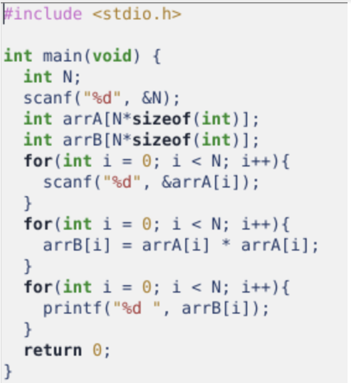
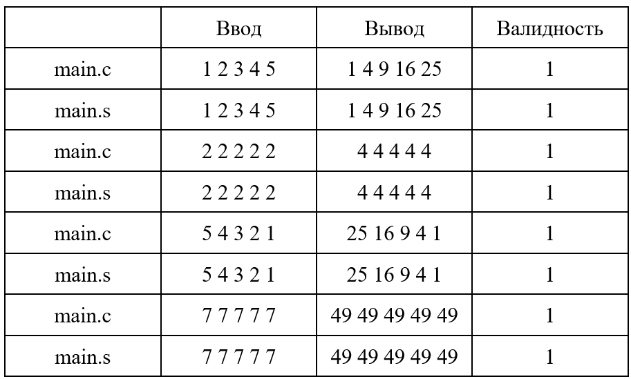
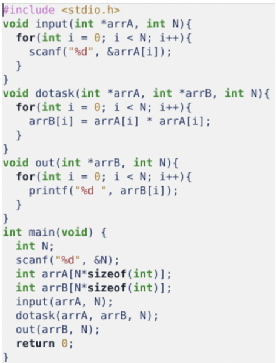
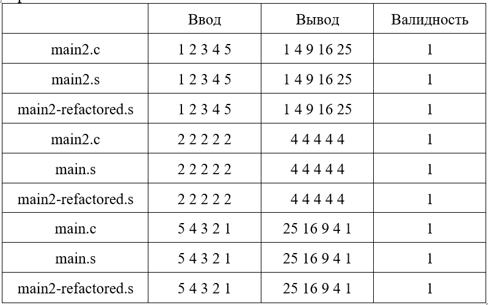
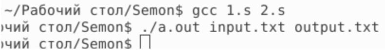
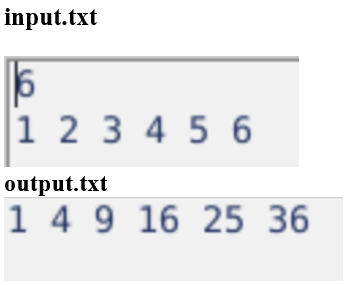

## Архитектура вычислительных систем
##### Котовский Семен Олегович, БПИ219
### ИДЗ №1
##### Вариант 39

<b>Задание</b>: Сформировать массив B, элементы которого являются площадью квадратов со сторонами указанные в массиве A.

## Отчёт о выполнении

#### *4	балла - выполнено*
<li>	Решение на C:</li>

Код находится в файле main.c
Для компиляции кода в assembler введу в терминал следующие команды поочерёдно.  
$gcc -O0 -Wall -fno-asynchronous-unwind-tables main.c -o main    
$gcc -O0 -Wall -fno-asynchronous-unwind-tables -S main.c -o main.s    
$gcc main.s -o   
Комментирование кода произведено. С результатом можно ознакомиться в main.s

Тестовое покрытие:

В таблице выше представлены результаты тестирования программы и показано, что
программа выводит одинаковый результат на обоих программах, что подтверждает корректность 
выполнения задания.
  
#### *5	баллов - выполнено*
 

Исходный код на Си:

Измененная программа была сохранена в файле main2.c

##### Реализованные функции(данные в функции передаются через параметры):
●	input() - получает на вход размер массива N и указатель на массив в которые будут заполняться данные. При выполнении этой функции мы получаем массив.

●	dotask() - получает на вход указатель на начальный массив и массив, в который будет записываться результат, количество элементов в массиве. Функция возводит каждый элемент из массива arrA, возводит в квадрат и записывает результат в массив arrB.

●	out() - получает на вход размер массива N и указатель на массив, который необходимо напечатать.

В коде программы написаны комментарии, которые объясняют 
процесс передачи параметров и возврата результата. Отдельно описан случай,
когда функция имеет тип void. Все параметры являются обязательными,
в программе отсутствуют формальные параметры.

#### *6 баллов - выполнено*
В комментарии добавлено объяснение связи между переменными в Си и регистрами
в ассемблерном коде.
Выполнен рефакторинг ассемблерного кода путем перевода работы со стеком в процессорные регистры.

Отредактированный код сохранён в файле main2-ref.s.
а также movl был заменён на movq.
Соответственно, movl eax, -24(%rbp) был заменён на movq rax, r12 и так далее.

В таблице выше представлены результаты тестирования программы и показано, что
программа выводит одинаковый результат на всех вариантах программы, что подтверждает корректность
выполнения задания.

#### *7 баллов - выполнено*
###### дополнение к требованиям на предыдущую оценку

Программа после рефакторинга представлена раздельными файлами: func.s & main_func.s

Код программы был разделён на два файла, один из которых содержит main, 
а второй - функции. Для ввода и вывода данных используются файлы input.txt и output.txt

Итоговая программа была сохранена под названием “main3.c”

Отредактированная программа в main3.s представлена раздельными файлами 1.s и 2.s. 

Запуск программы происходит следующим образом: 

Входной и выходной файлы после запуска:

